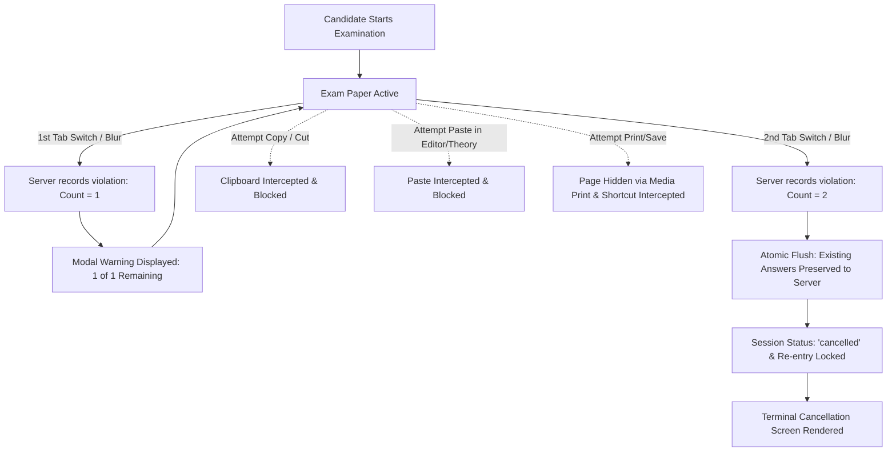

# 🎓 ExamDesk — Secure Online Examination & Evaluation Platform

<div align="center">

[](https://react.dev/)
[](https://vitejs.dev/)
[](https://nodejs.org/)
[](https://expressjs.com/)
[](https://www.mongodb.com/atlas)
[](https://jwt.io/)
[](#-examination-security--anti-cheating-system)
[](https://opensource.org/licenses/ISC)

<p align="center">
  <strong>A production-grade, full-stack examination portal engineered for institutional assessments, timed examinations, theory evaluations, and interactive code workspaces with strict security hardening.</strong>
</p>

[Key Features](#-key-features) • [Security System](#-examination-security--anti-cheating-system) • [Architecture](#-architecture) • [Getting Started](#-getting-started) • [API Reference](#-api-reference)

</div>

---

## 🌟 Key Features

### 👨‍🎓 Candidate / Student Experience
* **Live Timed Examination Paper:** Clean, distraction-free digital examination desk with persistent countdown timers and real-time section switching.
* **Three Comprehensive Question Sections:**
  * **Section A (Theory):** Structured long-form responses with real-time word limit counters.
  * **Section B (MCQ):** Instant single-choice questions with automated instant scoring.
  * **Section C (Coding):** Built-in multi-language code editor (JavaScript, Python, C++, Java, SQL) with template reset and clean syntax environment.
* **Exam Question Palette:** Instant visual tracking of answered, unanswered, and marked-for-review questions.
* **Detailed Post-Exam Scorecards:** Comprehensive breakdown of MCQ score, manual theory remarks, percentage, and passing status.

### 👩‍🏫 Administrator & Evaluator Suite
* **Examination Management:** Create, configure, update, and schedule examinations with custom durations, passing scores, and instruction policies.
* **Modular Question Banks & JSON Importer:** Fast bulk question ingestion using structured JSON imports.
* **Manual Answer Sheet Evaluation:** Dedicated evaluation dashboard for grading student theory explanations and inspecting candidate code solutions with custom mark assignment and inline teacher remarks.
* **Candidate Monitoring:** Instant visibility into student submission status (`in_progress`, `submitted`, `evaluating`, `graded`, `cancelled`).

---

## 🛡️ Examination Security & Anti-Cheating System

ExamDesk includes institutional-grade security mechanisms designed to preserve exam integrity without interfering with legitimate candidate workflows:



### 1. Tab-Switch Detection with Server-Side Enforcement
* **1st Tab Switch / Window Blur:** Triggers an official high-priority modal warning alerting the student that leaving the exam window is prohibited.
* **2nd Tab Switch / Window Blur:** Immediately terminates and cancels the examination session (`status: 'cancelled'`).
* **Server Persistence:** Tab violation counts are stored in MongoDB. Refreshing or reloading the browser page retrieves the recorded violation count and prevents counter resets.
* **Re-entry & Submission Lockout:** Cancelled examinations cannot be re-entered or submitted.
* **Work Preservation:** Student answers existing immediately before the second violation are securely written to the database before session termination, enabling fair administrative review.

### 2. Clipboard & Drag Protection
* **Pasting Disabled:** Students cannot paste external code or text into the theory input boxes or the coding workspace.
* **Copy & Cut Disabled:** Content selection and copying from the exam paper or question prompts is blocked.
* **Exam-Mode Code Editor:** The `Copy` button in the editor toolbar is hidden during examinations while preserving the `Reset` template button.
* **Typing Fully Preserved:** Manual typing, code indentation, backspace, and cursor navigation operate smoothly.

### 3. Print & Screenshot Deterrence
* Scoped print media deterrence (`@media print { body { display: none !important; } }`) hides content upon print dialog invocation.
* Keyboard shortcut interceptors for `Ctrl+P`, `Cmd+P`, `Ctrl+S`, `Cmd+S`, and `PrintScreen`.

---

## 🏗️ Technology Stack

| Domain | Technology | Description |
|---|---|---|
| **Frontend Framework** | React 19 + Vite 6 | Modern, component-based single-page application |
| **Routing** | React Router v7 | Protected role-based client routing |
| **Icons** | Lucide React | Lightweight, consistent iconography |
| **Backend Framework** | Node.js + Express 5 | Scalable REST API architecture |
| **Database** | MongoDB Atlas + Mongoose 9 | Cloud-native document storage with ACID validation |
| **Authentication** | JSON Web Tokens (JWT) + bcryptjs | Secure stateless token authentication and password hashing |

---

## 📂 Project Architecture

```
examportal/
├── client/                      # React + Vite Frontend Application
│   ├── src/
│   │   ├── components/          # Reusable UI (CodeEditor, QuestionPalette, Modals, Navbar)
│   │   ├── pages/
│   │   │   ├── admin/           # Admin Exam CRUD, Submissions, Evaluation Views
│   │   │   ├── student/         # Instructions, ExamPaper, Dashboard, Results
│   │   │   └── auth/            # Login, Registration
│   │   ├── services/            # Centralized API service layer (api.js)
│   │   └── styles/              # Component-scoped and design system CSS
│   └── vite.config.js           # Vite build configuration with API reverse-proxy
├── server/                      # Express REST API Server
│   ├── config/                  # Database connectivity (MongoDB Atlas)
│   ├── middleware/              # JWT authentication & student/admin guards
│   ├── models/                  # Mongoose Schemas (Exam, Question, ExamSubmission, etc.)
│   ├── routes/                  # Express API routers (auth, exams, student, submissions, results)
│   ├── test_flow.js             # Standard E2E verification test script
│   ├── test_security_verification.js # Comprehensive security & ObjectId verification script
│   └── index.js                 # Application entry point
├── render.yaml                  # Cloud deployment configuration
└── package.json                 # Monorepo management scripts
```

---

## 🚀 Getting Started

### Prerequisites
* **Node.js**: `v20.x` or `v22.x` installed ([nodejs.org](https://nodejs.org))
* **npm**: `v10.x` or later
* **MongoDB**: Active MongoDB Atlas cluster or local MongoDB instance

### 1. Clone & Install Dependencies

```bash
# Clone the repository
git clone https://github.com/Mediwateyash/exam-portal.git
cd exam-portal

# Install root dependencies
npm install --ignore-scripts

# Install client dependencies
npm --prefix client install
```

### 2. Environment Configuration

Create a `.env` file in the root directory (optional if using MongoDB Atlas defaults):

```env
PORT=5000
MONGODB_URI=mongodb+srv://<username>:<password>@<cluster>.mongodb.net/examdesk?retryWrites=true&w=majority
JWT_SECRET=your_secure_jwt_secret_key_here
```

### 3. Start Development Servers

Run both the backend API server (`localhost:5000`) and the Vite client (`localhost:5173`) concurrently:

```bash
npm run dev
```

Alternatively, run each service independently:

```bash
# Terminal 1: Backend server
npm run server

# Terminal 2: Vite Frontend
npm --prefix client run dev
```

---

## 🔑 Default Credentials

The platform automatically seeds demo accounts on first run:

| Role | Email | Password | Access Level |
|---|---|---|---|
| **Administrator / Teacher** | `admin@examdesk.com` | `admin123` | Full exam management & evaluation |
| **Candidate / Student** | `student@examdesk.com` | `student123` | Exam registration, taking, and results |

---

## 📡 API Reference Overview

### Student Examination Flow
| Method | Endpoint | Description |
|---|---|---|
| `GET` | `/api/student/exams` | List all available published examinations |
| `POST` | `/api/student/exams/:id/register` | Enroll student in an examination |
| `GET` | `/api/student/exams/:id/instructions` | Retrieve exam metadata, stats, and rules |
| `POST` | `/api/student/exams/:id/start` | Initialize examination session & countdown timer |
| `POST` | `/api/student/exams/:id/reattempt` | Initialize a fresh reattempt session (Attempt #2+) |
| `POST` | `/api/student/exams/:id/security-violation` | Record tab switch event (1st: warn, 2nd: cancel) |
| `POST` | `/api/student/exams/:id/save-answers` | Persist student answers safely on cancellation |
| `POST` | `/api/student/exams/:id/submit` | Final submission with instant MCQ auto-evaluation |

### Evaluation & Results Flow
| Method | Endpoint | Description |
|---|---|---|
| `GET` | `/api/submissions` | Retrieve all candidate exam submissions (Admin) |
| `GET` | `/api/submissions/:id` | View detailed answer sheet with theory & code answers (Admin) |
| `POST` | `/api/submissions/:id/evaluate` | Publish manual grades and remarks for candidate (Admin) |
| `GET` | `/api/results` | View list of completed examination results with attempt badges (Student) |
| `GET` | `/api/results/:submissionId` | View detailed scorecard, attempt switcher, and teacher remarks (Student) |

---

## 🧪 Verification & Testing

ExamDesk includes automated test suites to ensure zero regressions across security features and grading logic:

```bash
# Run 10-step full-stack verification flow:
node server/test_flow.js

# Run reattempt and multi-attempt verification suite:
node server/test_reattempt_flow.js

# Run strict security & anti-cheating verification suite:
node server/test_security_verification.js

# Validate client production bundle:
npm run build
```

---

## 📄 License

This project is licensed under the **ISC License**.
